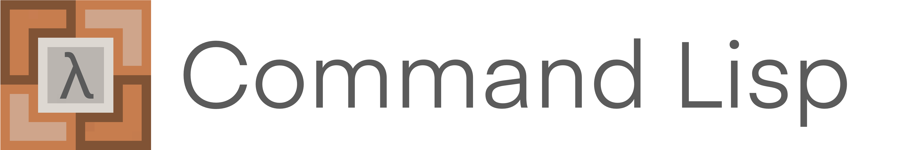

# Command Lisp


Command Lisp is a simplified language designed for Minecraft Bedrock Command System, characterized by a very high level of abstraction, which is also a dialect of Lisp.

> What sets Lisp apart is its design to be self-evolving. In Lisp, you can define new Lisp operators. When new abstract concepts become popular (such as object-oriented programming), we always find that these new concepts are easiest to implement in Lisp. 
> 
> Lisp is like the DNA of languages, a language that will never become obsolete.
> 
>  *Paul Graham*

## Command Lisp Compiler (clc)
This repository is mainly the compiler of language Command Lisp (clc). Clc is actively developing now but it still requires a lot of effort to accomplish the compiler.

### Set up environment
CL uses **dune** as the project manager like most ocaml projects. The project provides a quick environment for **nix**. The following command will automatically set up the developing environment (Linux):
```shell
nix-shell shell.nix
```

Or without nix:
```sh
sudo apt install ocaml opam
opam install core yojson
```

### Build Project
```sh
dune build
```

### Run CLC
```sh
dune exec clc
```

## Why Command Lisp (CL)?

In Minecraft Bedrock, editing commands can sometimes be very challenging, and the unstable game code has caused us a lot of trouble. Moreover, many commands are not very intuitive, significantly reducing work efficiency. The birth of CL is aimed at addressing these pain points, and using it, you can experience the following benefits:

- Write once, run in multiple places: You only need to use CL to complete command writing, and you can use our tools to import multiple saves, achieving reusability.
- High abstraction, high efficiency: CL language allows you to achieve more possibilities with less code.
- Simple and easy to learn: Lisp language is very intuitive and easy to understand.
- Reduce errors: Compared to finding errors directly in the command system, finding errors in CL scripts is obviously simpler.

## Why Ocaml
This project tried many languages ​​during the development process, and finally chose Ocaml. Click [here](design.md#why-ocaml) to see the detail

## Basic Syntax
The name "Command Lisp" is taken from "Common Lisp" and "Command", which indicates that the syntax of CL is similar to Common Lisp: Syntax is made up of **S-expressions**. An S-expression is either an **atom** or a **list**.

- Atoms can be integers (int32) like `114` and `514` or symbols like `cl`, `+` and etc.

- There’s also a special kind of **symbol** called keywords, which are colon-prefixed symbols like `:abc` or `:keyword`. Keywords evaluate to themselves (something like enums)

- Lists are made up with atoms

- All the expressions will be evaluates to a value.

### Comments
The comments in CL are very simple.

```lisp
; Single line comments start with a semicolon

#|
  Multi-line comment.
  #|
    Can be nested.
  |#
|#

```

### Hello World

```lisp
(tellraw :all "Hello World")
```
- This expression call a built-in function named `tellraw` with parameters `:all` and `"Hello World"`
- This command will print a message `Hello World` in screen
- The return value of this function will be always `0`

### Function
Function can be defined simply by `def`.

```lisp
(def fib (n)
  (if (< n 2)
      n
      (+ (fib (- n 1))
         (fib (- n 2)))))

(def name [param1 param2 param2 ...] (body) (expr))

(def square (n) (* n n))
```

Function call (application):
```lisp
(fib 10) ; 89
```

### Local variables

Local variables are normal lexically scoped variables (with `let` operator)

```lisp
(let ((x 10)) (square x)) ; 100
(let ((x 11) (y 4)) (+ x y)) ; 15
(let ((x 10) (y (+ x 2))) (+ x y)) ; 22
```

### IO
CL provides the following functions for print:

- `tellraw <target> <string>`
- `titleraw <target> <string>`
- `printf <target> <raw_string> <int list>`
- `titlef <target> <raw_string> <int list>`
- See the operation of scoreboards.

### Control Flow
Condition `if`
```lisp
(if (condition) (then) (else))
(if (> 4 3) 3 4) ; 3
(if (tag? :random "TEST")
    (write "Found player marked for TEST")
    (write "No player has the TEST tag"))
```

- The condition will be compiled to a `execute` command and the result (where `0` for `false` and `1` for `true`) will be pushed to the top of the data stack.
- The write is similar to `tellraw` but the first argument was set to `:all`.

Available predicates:
- `>`: greater than
- `<`: less than
- `>=`: greater than or equal
- `<=`: less than or equal
- `=`: equal
- `/=`: not equal
- `tag?`: has tag

For multi-case:
```lisp
(cond (((cond1) (then1)) ((cond2) (then2))))
```

### Command
Some essential command was included in CL core library but not all covered.

Inline Command (all these expression return `0` in default)
```lisp
(inline command) ; single
(seq [command1 command2 command3]) ; sequences
```

#### Macro System
The Macro System is a powerful and distinctive feature that sets Lisp apart from many other programming languages. Macros in Lisp allow developers to define new language constructs and extend the language itself (meta-programming). 

In Common Lisp, you can use more built-in function and data type which will be evaluated at compiling time. 

#### Target Selector
Target selector variables:
- `:all`: All players
- `:entity`: All entities
- `:nearest`: Nearest player
- `:random`: Random player
- `:self`: The executor itself

Or just use raw string:
```lisp
(tellraw "caimeo" "Hello World")
(tellraw "@e[r=10]" "Radius 10")
```

#### Scoreboard
- Read a value from scoreboard objectives
```lisp
(read :nearest "obj") 
; Read objective obj from nearest player. 
; This can be used for local variable definition.
```

- Set a value to scoreboard objectives
```lisp
(set :all "obj" 1) ; set obj to 1
```

- Read and save a value
```lisp
(let ((x (read :all "obj1"))) (set :all "obj2" x)) ; equiv to
(save :all "obj1" :all "obj2") ; save obj1 to obj2
```

- Swap the values

```lisp
(swap :all "obj1" :all "obj2") ; swap obj1 and obj2
```

#### Tag
```lisp
(tag+ :nearest TAG_1)
(tag- :random TAG_2)
(if (tag? :nearest TAG_3)
    (tellraw :all "wow"))
```

#### Async
Asynchronous programming is a programming paradigm that deals with the execution of operations that may run concurrently or independently, without the need for explicit synchronization. 

Asynchronous programming is particularly relevant in scenarios where certain operations, such as I/O operations may take a significant amount of time to complete, and waiting for them to finish in a synchronous manner would result in inefficiency and wasted resources.

In Minecraft world we may need something like *waiting a pig reach a particular area*, which is a async event. CL provides a feature called `await` (Wait until done) for this situation.

```lisp
(await (tag? :all "done")
       (tellraw :all "All done"))
```

- The code stops until all players are tagged with `done`.
- After that the tellraw expression will be executed.

```lisp
(await (/= 0 (read :nearest "value"))
       (let (v (read :nearest "value"))
       (printf :all "fib of ~d is ~d" v (fib v))))
```

- Read a value from nearest player's objective `value` (can't be `0`)
- Assign the score of `value` to variable `v`
- Calculate the `v`-th fibonacci number and print to screen

#### Teleport
```lisp
(tp :random :random)
(tp :all :nearest)
```

## Design
The design document of Command Lisp can be found [here](./design.md)

## License

GNU GENERAL PUBLIC LICENSE Version 3

