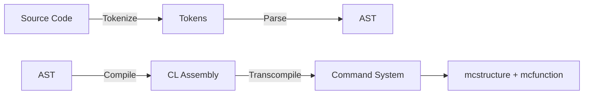

# Design of Command Lisp
## Goals
- A **turing complete** language with **s-expression** syntax (named Command Lisp)
- Support inter-operation with Minecraft Bedrock Command System (Always support the **newest** standard)
- Trans-compile CommandLisp to file format `mcstructure` and `mcfunction`
- High performance with **Low Cost Abstraction**

## Command Lisp Workflow

Command Lisp project is mainly a compiler which compiles CL code to CASM.
- `Main`: A CLI of Command Lisp
- `Parse`: The main parser
  - `parse`: parse source code into `expr`
  - `preprocess_and_compile`: insert main function and compile `expr` into `instr list` (CASM)
- `Control`: Implement of different memory layout (See world model) and algorithm to automatically assign registers
- `Command`: Provides all command generator
  - `ScoreBoard`: Scoreboard command 
  - `Execute`: Execute command
- `Util`: File and string related operations (And McFunction handler)
- `Nbt`: Named Binary Tag encoder (incomplete but enough for `mcstructure`)
  - `encode_nbt`: Encode nbt type to string
- `Mcs`: Handle mcstructure and metadata of command blocks (Save command system to files)
- `Vm`: A simulator (stack virtual machine) for CASM (incomplete: unable to handle syscall)
- `Arch`: A trans-compiler that compiles CASM into a command system

## Assembly Of Command Lisp
Command Lisp will first compiles source codes into CASM (Command Assembly) running on a specific stack machine.
### Registers
All the operands should be load to register to perform operation.

- `a0`: Acts as Null Unit. All the write operation to here will be deprecated. Read operation is not allowed
- `a1~a10`: Used for function arguments
- `x0~x10`: General purpose registers
- `t0~t10`: Save temporary values
- `sp`: Stack pointer, always points to the stack top
- `pc`: Program counter, points to the current instruction

### Data Types
All values and address should be 32 bit integer

### Memory
- Load from memory `ld t0 addr`
- Save to memory `sd t0 addr`

### System Call
The system call is performed by asm `syscall`. Before which you should set:
- `a1`: the operation code:
- `a2`: the arguments 1
- `a3`: the arguments 2
  - `write` (Operation Code is `93`): Write to output (`a2` for destination and `a3` the value)
    - `a2` can be `0` for **tellraw** and `1` for **titleraw**
  - Other commands will also be compiled to syscall with a unique operation code

### Instructions
The registers below should be `a0~a5` or `x0~x10`
- `ld reg0 *addr`: Load the value from `addr` to register `reg0`
- `sd reg0 *addr`: Save the value from register `reg0` to `addr`
- `set reg0 value`: Set a register to value
- `cst value`: Push a value into stack top
- `add reg0 reg1`: Add the value of `reg1` to `reg0` and saves to `reg0`
- `mul reg0 reg1`: Mul the value of `reg1` to `reg0` and saves to `reg0`
- `pop reg0`: Pop the stack top out and save to `reg0`
- `swap reg0 reg1`: Swap the value in `reg0` and `reg1`
- `goto reg0`: Set the program counter to the address stored in `reg0`
- `syscall`: perform system call
- `exit`: Clear all the registers and exit the program

### Examples
The simple addition:
```lisp
(tellraw (+ 114 514))
```
will be compiled to:
```asm
# Add begin
cst 114
cst 514
pop x0
pop x1
add x0, x1 ## x0 = 628
# Add end
# Write begin
set a1 93
ld a2 x0
syscall
# Write end (The screens shows "628")
```

## Command System
Command system is a object (`system`) contains metadata of every command and its location information (also with some world structures inside)
```ocaml
type system = {
  name : string;
  init_program : command_sequence;
  entry_program : command_sequence;
  programs : command_sequence list;
  boundbox : int * int * int; (* max size of system *)
}
```
- A sequence of command block is store as a `command_block list`
- `command_block` is a record type with metadata of the command block 
```ocaml
type command_block = {
  command : string;
  block_type : block_type;
  condition : bool;
  auto : bool;
  execute_on_first_tick : bool;
  hover_note : string;
  delay : int;
  previous_output : string;
}
```


## World Model
The world model explains how the commands will be generated.

### Memory Layout
- All the data will be processed in **CPU** registers before which a `read` operation should be performed.
- There are more than one stacks in CL for different purposes (function call and normal stack). All the data stores in the normal **data stack** and the return address in **call stack**. Stack supports the following operations:
  - Pop: Pop the value in the stack top
  - Push: Push a value to the stack top
  - Peek: Peek the value in the stack top (Leave the stack unchanged)
- The Stack Pointer (`sp`): A pointer in register `sp` that points to the stack top

#### CPU Design
- The CPU registers are all **objectives** (named `x0,x1` and something like these) that attached to a **virtual player** (The score holder) named `CPU`

#### Proposal One - Entity Stack
In this standard we use entity (It can be `armor_stand`) as the stack.
- Every single entity represents a stack frame
- Use a **directed** (The direction can be `x+`) sequence of entities as a stack (Form a list in the minecraft world.)
- Every entity has a score objective named `stack` which saves the value of the stack frame
- The entity at stack top has a tag `stack_top`

##### Push Operation
- Add a tag `to_be_removed` to the stack top entity
- Add a tag `stack_top` to the entity positioned `direction + 1`
- Remove the tag `stack_top` from the entity with tag `to_be_removed`
- Remove the tag `to_be_removed`
- Load the value at a register to the entity with tag `stack_top`

##### Pop Operation
- Load the value at the stack top to a register
- Add a tag `to_be_removed` to the stack top entity
- Add a tag `stack_top` to the entity positioned `direction - 1`
- Remove the tag `stack_top` from the entity with tag `to_be_removed`
- Remove the tag `to_be_removed`

##### Peek Operation
- Load the value at the stack top to a register

##### Constant Operation over Stack Pointer
Suppose we need to find the stack at `sp - n`. `<Entity>` can be substituted with a specific entity.
- Add a tag `to_be_removed` to the stack top entity
- Locate the stack top entity `execute as @r[type=<Entity>,tag=stack_top] run <Offset>`
- Find the offset stack frame `<Offset> := execute positioned ~-n ~ ~ run <TagAdd>`
- Add the stack_top tag `<TagAdd> := tag @r[r=0, type=<Entity>] stack_top`
- Remove the tag `stack_top` from the entity with tag `to_be_removed`
- Remove the tag `to_be_removed`

> A sub proposal: Tag every stack frame with a number for ordering.

#### Proposal Two - Scoreboard Stack
This standard uses virtual player as stack frame

### Instructions
Problems:
- How to handle program requires multi loop?
> Progma that tags an expression?

### Preprocessor
- The preprocessor is used for registering some blocks, entities and etc.
- The preprocessor will be compiled to the **init program**.
### Syscall
Syscall will be compiled to a sequence of commands containing:
- Set up (Optional): Read the data from the stack to the registers
- Run the command
- Garbage collection (Optional): clean the registers 
#### Example
Tellraw / Titleraw:
- Set up: Reading values to specific registers
- Run command `tellraw / titleraw`

### Minecraft Structure 
The generate CL system (One or more `mcstructure` files) contains the following programs (One Program is a sequence of command blocks)
- Init: Initialize the system. (A normal program but with a button in the head.)
- Loop: A loop program is a sequence starting with a **repeated command block** 
- Normal: A normal program is a sequence staring with an **impulse command block**.
- Entry point: A normal program but with a button in the head.

> The following features are not designed yet and may not be implemented.
### Multithreading
### Async / Await

## Notes of command
