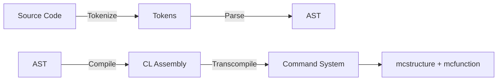

# Design of Command Lisp

## Objectives

The primary objectives of the Command Lisp language are as follows:

- **Turing Completeness**: Command Lisp aims to be a Turing-complete language, providing a comprehensive set of computational capabilities.

- **S-expression Syntax**: The language adopts an S-expression syntax, enhancing readability and expressiveness in code.

- **Compatibility with Minecraft Bedrock Command System**: Command Lisp is designed to seamlessly interoperate with the Minecraft Bedrock Command System, ensuring compatibility with the latest standards.

- **Trans-compilation to `mcstructure` and `mcfunction`**: Command Lisp includes a trans-compiler to generate code in the `mcstructure` and `mcfunction` file formats, facilitating integration with the Minecraft Bedrock platform.

- **High Performance with Low Cost Abstraction**: Command Lisp prioritizes high performance while minimizing abstraction costs. This approach ensures efficient execution of commands within the Minecraft Bedrock environment.

These objectives collectively define the foundation of Command Lisp, emphasizing its versatility, compatibility, and efficiency in the context of Minecraft Bedrock command development.

## Command Lisp Workflow

The Command Lisp project primarily functions as a compiler, translating CL code into CASM and generating files. The project is structured into various **modules** to handle distinct aspects of the compilation process:

- **Main Module (`Main`)**
  - Serves as the Command Line Interface (CLI) for Command Lisp.

- **Parsing Module (`Parse`)**
  - `parse`: Responsible for parsing source code into an intermediate representation (`expr`).
  - `preprocess_and_compile`: Inserts the main function and compiles the `expr` into a list of instructions (`instr list`), represented in CASM.

- **Control Module (`Control`)**
  - Implements different memory layouts, referring to the world model, and employs algorithms for automatic register assignment.

- **Command Module (`Command`)**
  - Houses various command generators, including:
    - `ScoreBoard`: Generates scoreboard commands.
    - `Execute`: Facilitates the execution of commands.

- **Utility Module (`Util`)**
  - Manages file and string-related operations, including handling McFunction.

- **Nbt Module (`Nbt`)**
  - Handles Named Binary Tag (NBT) encoding, albeit incompletely, yet sufficient for `mcstructure`.
    - `encode_nbt`: Encodes NBT types into strings.

- **Mcs Module (`Mcs`)**
  - Manages `mcstructure` and metadata of command blocks, allowing for the saving of the command system to files.

- **Vm Module (`Vm`)**
  - Features a simulator, specifically a stack virtual machine, for CASM. Note: It remains incomplete and is currently unable to handle syscalls.

- **Arch Module (`Arch`)**
  - Serves as a trans-compiler, converting CASM into a command system.

This modular design ensures a structured and organized approach to the development of Command Lisp, enhancing maintainability and extensibility throughout its various components.

## Syntax of Command Lisp


## Assembly Of Command Lisp
Command Lisp will first compiles source codes into CASM (Command Assembly) running on a specific stack machine.
### Registers
All the operands should be load to register to perform operation.

- `a0`: Acts as Null Unit. All the write operation to here will be deprecated. Read operation is not allowed
- `a1~a10`: Used for function arguments
- `x0~x10`: General purpose registers
- `t0~t10`: Save temporary values
- `sp`: Stack pointer, always points to the stack top
- `pc`: Program counter, points to the current instruction

### Data Types
All values and address should be 32 bit integer

### Memory
- Load from memory `ld t0 addr`
- Save to memory `sd t0 addr`

### System Call
The system call is performed by asm `syscall`. Before which you should set:
- `a1`: the operation code:
- `a2`: the arguments 1
- `a3`: the arguments 2
  - `write` (Operation Code is `93`): Write to output (`a2` for destination and `a3` the value)
    - `a2` can be `0` for **tellraw** and `1` for **titleraw**
  - Other commands will also be compiled to syscall with a unique operation code

### Instructions
The registers below should be `a0~a5` or `x0~x10`
- `ld reg0 *addr`: Load the value from `addr` to register `reg0`
- `sd reg0 *addr`: Save the value from register `reg0` to `addr`
- `set reg0 value`: Set a register to value
- `cst value`: Push a value into stack top
- `add reg0 reg1`: Add the value of `reg1` to `reg0` and saves to `reg0`
- `mul reg0 reg1`: Mul the value of `reg1` to `reg0` and saves to `reg0`
- `pop reg0`: Pop the stack top out and save to `reg0`
- `swap reg0 reg1`: Swap the value in `reg0` and `reg1`
- `goto reg0`: Set the program counter to the address stored in `reg0`
- `syscall`: perform system call
- `exit`: Clear all the registers and exit the program

### Examples
The simple addition:
```lisp
(tellraw (+ 114 514))
```
will be compiled to:
```asm
# Add begin
cst 114
cst 514
pop x0
pop x1
add x0, x1 ## x0 = 628
# Add end
# Write begin
set a1 93
ld a2 x0
syscall
# Write end (The screens shows "628")
```

## Command System
Command system is a object (`system`) contains metadata of every command and its location information (also with some world structures inside)
```ocaml
type system = {
  name : string;
  init_program : command_sequence;
  entry_program : command_sequence;
  programs : command_sequence list;
  boundbox : int * int * int; (* max size of system *)
}
```
- A sequence of command block is store as a `command_block list`
- `command_block` is a record type with metadata of the command block 
```ocaml
type command_block = {
  command : string;
  block_type : block_type;
  condition : bool;
  auto : bool;
  execute_on_first_tick : bool;
  hover_note : string;
  delay : int;
  previous_output : string;
}
```


## World Model
The world model explains how the commands will be generated.

### Memory Layout
- All the data will be processed in **CPU** registers before which a `read` operation should be performed.
- There are more than one stacks in CL for different purposes (function call and normal stack). All the data stores in the normal **data stack** and the return address in **call stack**. Stack supports the following operations:
  - Pop: Pop the value in the stack top
  - Push: Push a value to the stack top
  - Peek: Peek the value in the stack top (Leave the stack unchanged)
- The Stack Pointer (`sp`): A pointer in register `sp` that points to the stack top

#### CPU Design
- The CPU registers are all **objectives** (named `x0,x1` and something like these) that attached to a **virtual player** (The score holder) named `CPU`

#### Proposal One - Entity Stack
In this standard we use entity (It can be `armor_stand`) as the stack.
- Every single entity represents a stack frame
- Use a **directed** (The direction can be `x+`) sequence of entities as a stack (Form a list in the minecraft world.)
- Every entity has a score objective named `stack` which saves the value of the stack frame
- The entity at stack top has a tag `stack_top`

##### Push Operation
- Add a tag `to_be_removed` to the stack top entity
- Add a tag `stack_top` to the entity positioned `direction + 1`
- Remove the tag `stack_top` from the entity with tag `to_be_removed`
- Remove the tag `to_be_removed`
- Load the value at a register to the entity with tag `stack_top`

##### Pop Operation
- Load the value at the stack top to a register
- Add a tag `to_be_removed` to the stack top entity
- Add a tag `stack_top` to the entity positioned `direction - 1`
- Remove the tag `stack_top` from the entity with tag `to_be_removed`
- Remove the tag `to_be_removed`

##### Peek Operation
- Load the value at the stack top to a register

##### Constant Operation over Stack Pointer
Suppose we need to find the stack at `sp - n`. `<Entity>` can be substituted with a specific entity.
- Add a tag `to_be_removed` to the stack top entity
- Locate the stack top entity `execute as @r[type=<Entity>,tag=stack_top] run <Offset>`
- Find the offset stack frame `<Offset> := execute positioned ~-n ~ ~ run <TagAdd>`
- Add the stack_top tag `<TagAdd> := tag @r[r=0, type=<Entity>] stack_top`
- Remove the tag `stack_top` from the entity with tag `to_be_removed`
- Remove the tag `to_be_removed`

> A sub proposal: Tag every stack frame with a number for ordering.

#### Proposal Two - Scoreboard Stack
This standard uses virtual player as stack frame

### Instructions
Problems:
- How to handle program requires multi loop?
> Progma that tags an expression?

### Preprocessor
- The preprocessor is used for registering some blocks, entities and etc.
- The preprocessor will be compiled to the **init program**.
### Syscall
Syscall will be compiled to a sequence of commands containing:
- Set up (Optional): Read the data from the stack to the registers
- Run the command
- Garbage collection (Optional): clean the registers 
#### Example
Tellraw / Titleraw:
- Set up: Reading values to specific registers
- Run command `tellraw / titleraw`

### Minecraft Structure

Within the generated Command Lisp (CL) system, comprised of one or more `mcstructure` and `mcfunction` files, the following program types are delineated. Each program is essentially a sequence of command blocks:

- **Init Program:**
  - Description: Initializes the system.
  - Structure: Resembles a normal program but incorporates a button in the header.

- **Loop Program:**
  - Description: A sequence that commences with a repeated command block.
  - Structure: Consists of a series of command blocks, with the initiation being marked by a repeated command block.

- **Normal Program:**
  - Description: A sequence that commences with an impulse command block.
  - Structure: Comprises a series of command blocks, starting with an impulse command block.

- **Entry Point Program:**
  - Description: Essentially a normal program but distinguished by the presence of a button in the header.
  - Structure: Resembles a normal program with the addition of a button at the beginning.

This categorization facilitates a clear distinction between different program types within the Minecraft structure generated by Command Lisp. Each type serves a specific purpose, contributing to the overall functionality and organization of the system.

> The following features are not designed yet and may not be implemented.
### Multithreading
### Async / Await

## Notes of command
